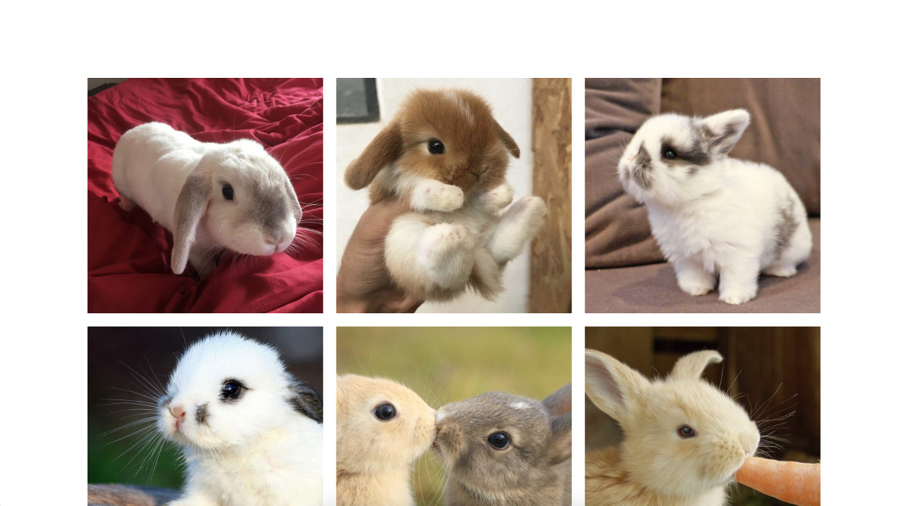

## Randomly Schedule Tweets

### Install

- Install requirements ```pip install -r requirements.txt```
- Create Twitter app at https://apps.twitter.com and get your keys
- Edit conf.ini with all your juicy details (min/max_sleep are in minutes - test_mode 0/1)

```
usage: run.py [-h] [-t] [-w] [-c]

optional arguments:
  -h, --help   show this help message and exit
  -t, --tweet  read from the database and tweet
  -w, --write  write to the database from input.txt
  -c, --clear  delete all in the database
```

### Steps to add new tweets

- Remove all demo images in images/ and insert your own
- Edit input.txt with your tweet text and image name (careful with the extension)
- Run ```run.py -w``` to write the data to the database

### Steps to run

- Make sure you have added tweets in the database
- Run ```run.py -t``` and it will keep tweeting until there are no more tweets

### Gallery Website

Included is a simple PHP file to read the json database and create a simple gallery. Just point it to your json file and the images directory. Have fun!



##### TODO

- Oauth


Feel free to fork this repo and create a pull request.
